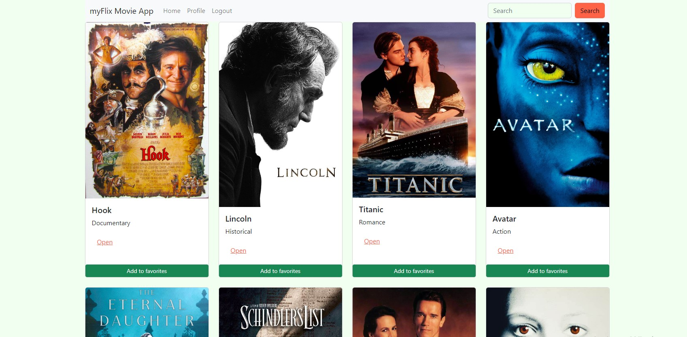

# myFlix React App

# 📗 Table of Contents

- [📖 About the Project](#about-project)
  - [🛠 Built With](#built-with)
    - [Tech Stack](#tech-stack) 
    - [Features](#features) 
    - [🚀 Live Demo](#live-demo)
- [👥 Authors](#authors)

<!-- PROJECT DESCRIPTION -->

# 📖 [myFlix React App] 

Build a movie client-side app with React as Front-End and using a REST API as Back-End.

## 🛠 Built With 

### Tech Stack 

  
React
 
  
Bootstrap
 
  
JavaScript
 
  
HTML
 
  
CSS 
 

(<a href="#readme-top">back to top</a>)

<!-- FEATURES -->

## Features 

● Returns ALL movies to the user (each movie item with an image, title, and description) 
● Filtering the list of movies with a “search” feature 
● Ability to select a movie for more details 
● Ability to log out 
● Ability to navigate to Profile view 

<h3>Single Movie view</h3> 
● Returns data (description, genre, director, image) about a single movie to the user 
● Allows users to add a movie to their list of favorites 

<h3>Login view</h3> 
● Allows users to log in with a username and password 

<h3>Signup view</h3> 
● Allows new users to register (username, password, email, date of birth) 

<h3>Profile view</h3> 

● Displays user registration details 
● Allows users to update their info (username, password, email, date of birth) 
● Displays favorite movies 
● Allows users to remove a movie from their list of favorites 
● Allows existing users to deregister 

(<a href="#readme-top">back to top</a>)

<!-- LIVE DEMO -->

## 🚀 Live Demo 

- [Live Demo Link](https://famous-otter-8efa34.netlify.app/)

(<a href="#readme-top">back to top</a>)

<!-- AUTHORS -->

## 👥 Authors 

👤 **Marina Celestino**

- GitHub: [@githubhandle](https://github.com/Mcelest19)
- LinkedIn: [LinkedIn](https://www.linkedin.com/in/marina-celestino-90319a166/)

(<a href="#readme-top">back to top</a>)
 
